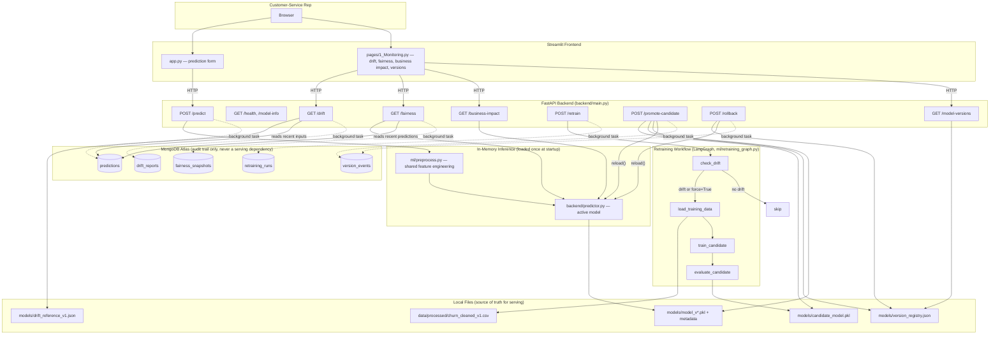

# Telecom Customer Churn Prediction System

A production-oriented churn prediction service built end-to-end: real-time inference API, a customer-service-facing UI, data/model drift detection, an orchestrated retraining workflow, model versioning with rollback, explainability, fairness auditing, and business-impact simulation.

It was built as a full implementation of a production-ML systems brief — the kind of take-home that asks "design a churn prediction system for a telecom company with 10 million customers, covering data quality, drift, retraining, versioning, explainability, fairness, monitoring, business impact, and sub-100ms real-time serving" — rather than a notebook-only proof of concept.

**Dataset:** [Telco Customer Churn (IBM sample)](https://www.kaggle.com/datasets/blastchar/telco-customer-churn) — 7,043 customers, 21 columns.

---

## Architecture



**Key architectural decisions:**

- **The model is loaded once at process startup**, not per request — `/predict` just runs already-loaded inference, which is what keeps latency in the tens-of-milliseconds range instead of hundreds.
- **MongoDB is an audit trail, never a dependency of serving.** If Atlas is unreachable, `/predict`, `/drift`, `/fairness`, and every other endpoint still return valid responses with safe defaults — logging failures never block a business-critical prediction.
- **`models/version_registry.json` (a local file), not MongoDB, is the source of truth for which model version is active.** Promotion and rollback must keep working even if the database is down.
- **LangGraph-based retraining is deliberately isolated from the real-time path.** It only runs on an explicit `POST /retrain` call, never inside `/predict`, so a slow or failed retraining run can never affect a customer-service rep's request.
- **A trained candidate is never auto-promoted.** `POST /retrain` only ever writes `candidate_model.pkl`; a human must call `POST /promote-candidate` before it serves live traffic.

---

## What's implemented

| Capability | Where |
|---|---|
| Data cleaning & EDA | `notebooks/01_data_cleaning_and_eda.ipynb` |
| Feature engineering (shared train/inference) | `ml/preprocess.py`, `notebooks/02_feature_engineering.ipynb` |
| Model training & evaluation | `ml/train.py`, `notebooks/03_model_training.ipynb` |
| Real-time inference API (sub-100ms) | `backend/main.py`, `backend/predictor.py` |
| Request validation | `backend/schemas.py` (Pydantic) |
| Prediction logging (async, non-blocking) | `backend/database.py` (MongoDB Atlas) |
| Data drift detection (PSI-based) | `ml/drift.py` |
| Automated retraining orchestration | `ml/retraining_graph.py` (LangGraph) |
| Model versioning & rollback | `backend/versioning.py` |
| Fairness auditing (training + live proxy) | `ml/fairness.py` |
| Business impact simulation | `ml/business_impact.py` |
| Monitoring dashboard | `frontend/pages/1_Monitoring.py` |
| Customer-service UI | `frontend/app.py` |
| Test suite (67 tests) | `tests/test_api.py`, `tests/test_streamlit_apps.py` |
| Load/latency testing (standalone, non-CI) | `tests/load_test.py` |

Model in production (`model_v1`): Logistic Regression, precision 0.508 / recall 0.805 / F1 0.623 / ROC-AUC 0.845 on a held-out test set, trained with `class_weight="balanced"` to handle class imbalance. Recall is prioritized over precision deliberately — a missed churner is more costly to the business than a false alarm.

---

## API reference

| Method | Endpoint | Purpose |
|---|---|---|
| `GET` | `/health` | Model/DB liveness for monitoring |
| `GET` | `/model-info` | Active model's metadata and metrics |
| `POST` | `/predict` | Real-time churn prediction for one customer |
| `GET` | `/predictions` | Recent prediction history |
| `GET` | `/metrics` | Aggregate monitoring metrics |
| `GET` | `/drift` | PSI-based data drift report vs. training baseline |
| `POST` | `/retrain` | Trigger the LangGraph retraining workflow |
| `GET` | `/model-versions` | Full version registry (active + history) |
| `POST` | `/promote-candidate` | Promote the last-trained candidate to production |
| `POST` | `/rollback` | Revert to a previous model version |
| `GET` | `/fairness` | Training-time fairness audit + live selection-rate proxy |
| `GET` | `/business-impact` | ROI-aware business impact simulation, with population scaling |

Interactive docs are available at `/docs` (Swagger UI) once the backend is running.

---

## Tech stack

- **Language/runtime:** Python 3.11
- **ML:** scikit-learn 1.8.0 (pinned), pandas, numpy, joblib
- **API:** FastAPI, Pydantic 2, uvicorn
- **Orchestration:** LangGraph (retraining workflow)
- **UI:** Streamlit
- **Database:** MongoDB Atlas (via pymongo; `mongomock` for tests)
- **Testing:** pytest, FastAPI `TestClient`, Streamlit `AppTest`

---

## Project structure

```
telecom-churn-ai/
├── backend/            # FastAPI app, schemas, predictor, versioning, database
├── ml/                 # preprocessing, drift, fairness, training, business impact, retraining graph
├── frontend/           # Streamlit app + monitoring dashboard
├── models/             # model artifacts, drift baseline, version registry
├── data/               # raw and processed datasets
├── notebooks/          # data cleaning, feature engineering, model training
├── tests/              # pytest suite + standalone load test
├── .env.example
└── requirements.txt
```

---

## Setup

1. **Clone and create a virtual environment**
   ```
   git clone <your-repo-url>
   cd telecom-churn-ai
   python -m venv .venv
   .venv\Scripts\activate
   ```

2. **Install dependencies**
   ```
   pip install -r requirements.txt
   pip install -r backend/requirements.txt
   pip install -r frontend/requirements.txt
   ```

3. **Configure environment variables**
   ```
   copy .env.example .env
   ```
   Set `MONGODB_URI` to a real MongoDB Atlas connection string. If omitted or set to `mongomock`, the backend runs with an in-memory mock database (fine for local dev, not for production).

4. **Run the backend**
   ```
   uvicorn backend.main:app --reload
   ```
   API docs: http://127.0.0.1:8000/docs

5. **Run the frontend** (in a second terminal)
   ```
   streamlit run frontend/app.py
   ```

6. **Run the tests**
   ```
   pytest
   ```
   67 tests should pass. Optionally, run the standalone load test:
   ```
   python tests/load_test.py --requests 200 --workers 10
   ```

---

## Known limitations (stated plainly, not glossed over)

- **No real labeled-feedback loop.** Retraining currently re-trains on the same base dataset that produced `model_v1` — it demonstrates the orchestration mechanics end-to-end, but isn't yet learning from new, actually-observed churn outcomes. `actual_outcome` is logged as a field on every prediction but is always `None` today.
- **Business impact numbers are a simulation, not a measured outcome.** `retention_success_rate`, `intervention_cost_per_contact`, and `customer_lifetime_months` are configurable assumptions layered on top of real confusion-matrix data from the last training run — never presented as verified results.
- **Live fairness monitoring is a proxy.** It can only measure demographic parity (who gets flagged) from live traffic, since live predictions have no ground truth. Recall/false-positive-rate parity is only available from the training-time audit.
- **The version registry assumes a single backend worker process.** The concurrency fix (Phase 17) covers concurrent threads within one process via a lock + atomic file write; a genuinely multi-process deployment would need a shared lock (e.g., a database-backed one) instead.
- **Concept drift detection** (as distinct from the data drift already implemented) has not been built yet.

## Roadmap

- [ ] Render deployment (backend + frontend as separate services)
- [ ] Broader end-to-end / integration testing against the deployed system
- [ ] Concept drift detection
- [ ] CI (GitHub Actions running `pytest` on push)
